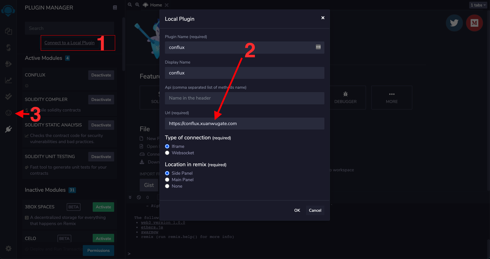
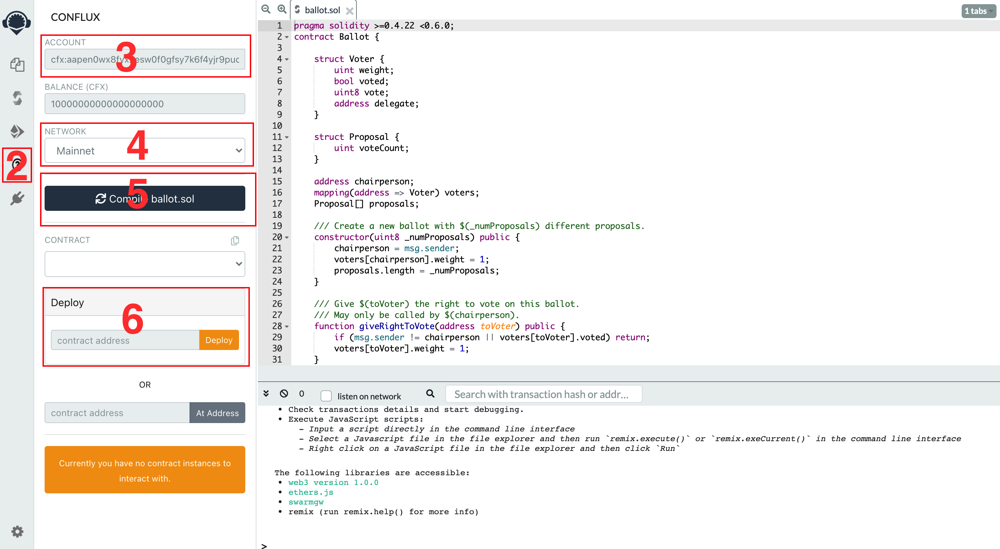

# Conflux Plugin for Remix

The Conflux plugin for Ethereum's Remix IDE. It support for deploy and interacting on a Conflux network.


# Getting Started
1. Click RemixIDE Plugin Manager Icon and activate Conflux Plugin

2. Click Conflux Plugin Icon

3. Connect ConfluxPortal Wallet Account
4. Select Network
5. Compile your smart contract
6. Select Contract to deploy
7. Deploy

# Scripts

Clone the github repository:
```
git clone https://github.com/conflux-dao-toc/conflux-remix-plugin.git
```
In the project directory, you can run:

```
cd conflux-remix-plugin
yarn start
```

Runs the app in the development mode.<br />
Open [http://localhost:3000](http://localhost:3000) to view it in the browser.

The page will reload if you make edits.<br />
You will also see any lint errors in the console.
